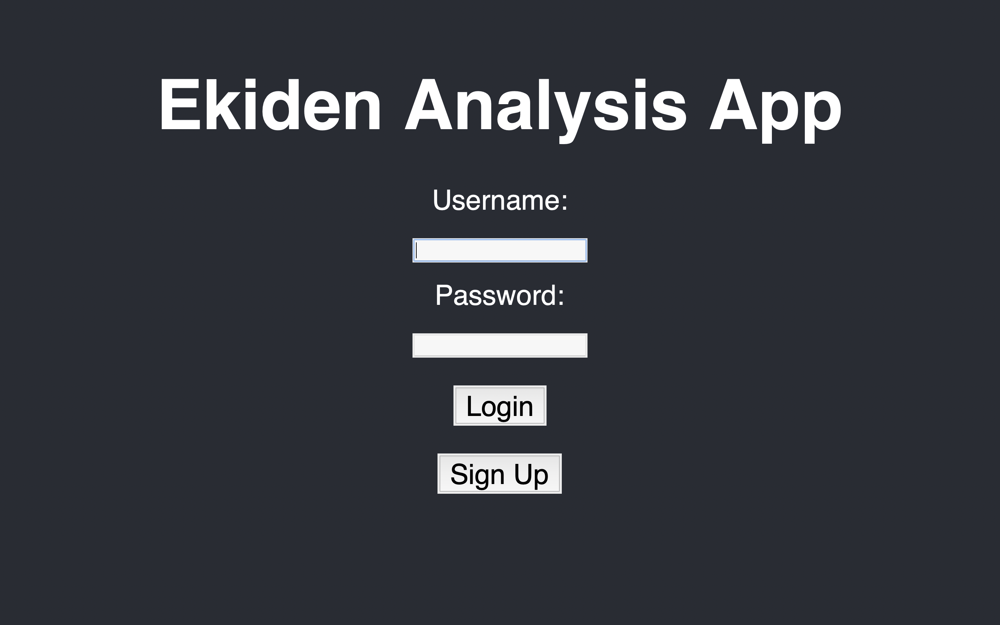
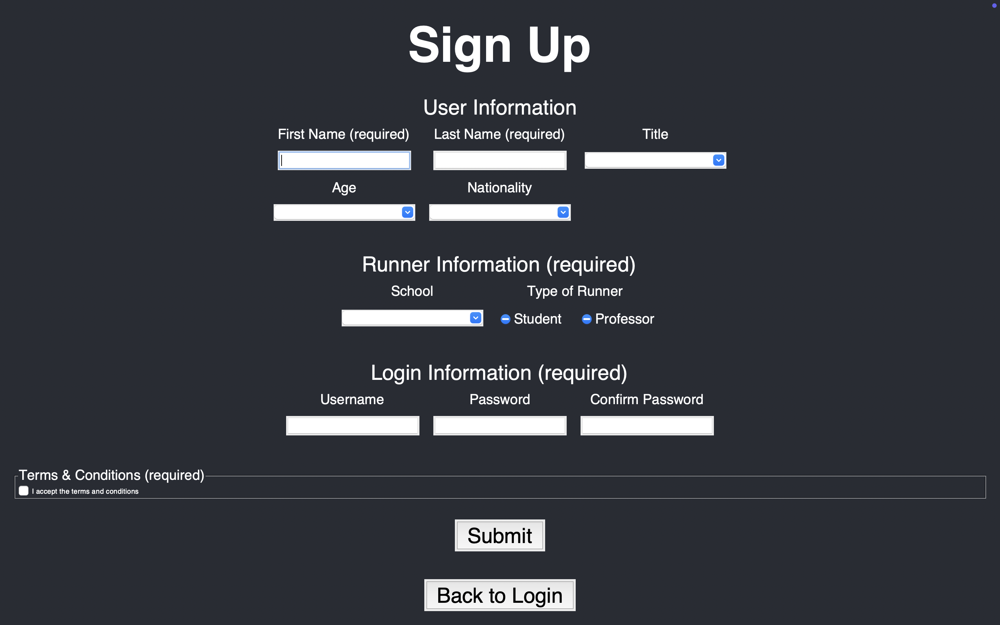
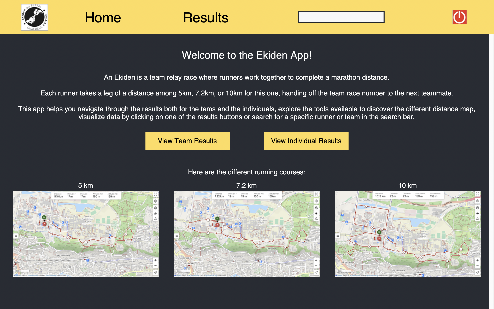
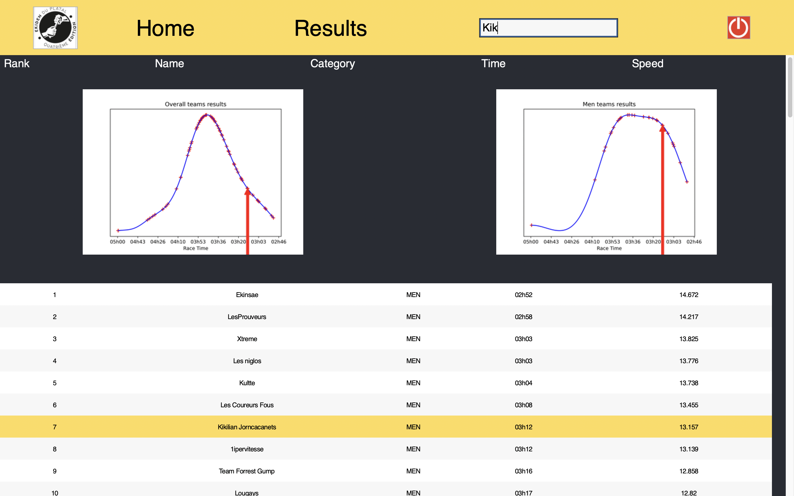

# Ekiden Race Results App in Python  
> I’ve done an App in Python to show the different results linked to an Ekiden (a marathon relay in teams), just to get used to Tkinter and the Python classes to be prepared for much bigger project on the same topic, but that will push it further, including some machine learning tools (so I can practice it a bit). It does include some parsing of the input, function to help navigate through all the data, and a complete app to show them, including a login and sign-up part to simulate an app you need to connect from an account (but in an unsafe way because it’s based on basic Excel file) as well as the main screen where you can choose what you want to be shown to you or to search for a specific name in the search bar.


#### Tables of contents
* [Path tree](#path-tree)
* [Direct links to folders](#direct-links-to-folders)  
* [Virtual Environnment and Librairies](#virtual-environnment-and-librairies)  
* [App preview](#app-preview)


## Path tree
```
Ekiden_Race_Results_App/
├── Data/
│   ├── Pictures/              # contains some useful picture to show in the app and the README
│   ├── Precomputed_graphs/    # contains the precomputed generic picture for overall rankings
│   └── functions and datas
│
├── Test_Tkinter/
│   ├── tests_done/            # basics test to see how every type of things in working in Tkinter
│   ├── screens_tests/         # testing the different screen I will later use 
│   └── first_app_try/         # how I progressively shaped the current app by adding everything together and improving the rendering
│
└── main functions             
```


## Direct links to folders 
* [Data](./Data/) :
    * [Pictures](./Data/Pictures/) : contains some useful picture to show in the app and the README
    * [Precomputed_graphs](./Data/Precomputed_graphs/) : contains the precomputed generic picture for overall rankings
* [Test Tkinter](./Test_Tkinter/) : 
    * [tests done](./Test_Tkinter/tests_done/) : basics test to see how every type of things in working in Tkinter 
    * [screens tests](./Test_Tkinter/screens_tests/) : testing the different screen I will later use 
    * [first app try](./Test_Tkinter/first_app_try/) : how I progressively shaped the current app by adding everything together and improving the rendering


## Virtual Environnment and Librairies
Since the libraries are not installed on my Mac, I need to set up a virtual environment to access and use the required libraries, here is how to do :

Creating the virtual environnment
```
python3 -m venv path/to/venv
```
Activating the virtual environnment
```
source path/to/venv/bin/activate
```
Downloading the librairies you need in the virtual environnment
```
python3 -m pip install what_you_need
```
To temporarly deactivate the virtual environnment
```
deactivate 
```

I used those librairies for this project : 
```py
import openpyxl # using excel 
import os # searching paths
import re # regular expression
from enum import Enum
import numpy as np
from scipy.stats import kde # gaussian modelisation
import matplotlib.pyplot as plt # to plot things
import matplotlib.ticker as ticker # plots customization
import tkinter as tk # tkinter 
from tkinter import ttk # for more modern and and customizable widgets 
from tkinter import messagebox # for errors messages
from tkinter import PhotoImage # for pictures 
from PIL import Image, ImageTk # a better rezising
```


## App preview 
#### How to use it
every button is clickable and will redirect you to the corresponding part of the App, you can use it like any app. For the login and the sign-up screens, the cursor is directly on the first entry, so we can type as soon as we wanted, and the tabulation and enter key does work here to move to the next entry to continue
Here is a preview of some screens you will encounter when lauching the app : 

#### Login screen render


#### Sign-up screen render


#### Home screen render


#### Search screen render

